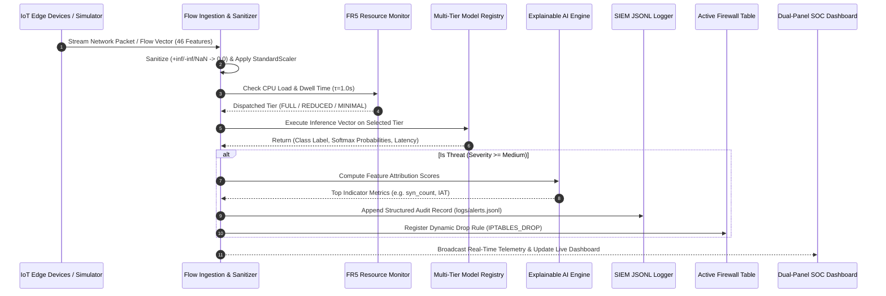
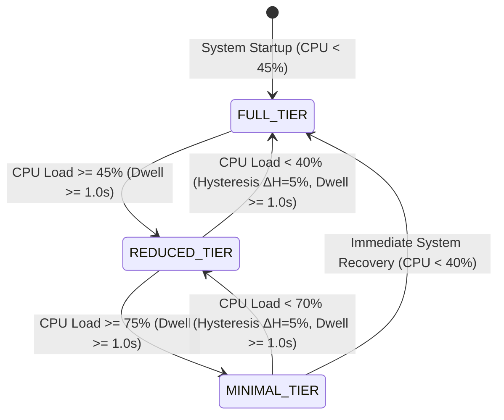

# Application Flow & System State Machine (APP_FLOW.md)

## Project: Fog-IDS — Autonomous Multi-Class Network Intrusion Detection System
**Target Audience:** System Architects, Core Developers, SOC Operators  
**Document Status:** Production  

---

## 1. End-to-End System Ingestion & Defense Flow



---

## 2. Core Functional Flows

### 2.1 FR5 Dynamic Resource Switching Cycle



- **Hysteresis Deadband ($\Delta H = 5\%$):** Prevents tier flapping at boundary values (e.g., $44.8\% \leftrightarrow 45.2\%$).
- **Dwell Time ($\tau = 1.0\text{ s}$):** Requires load conditions to persist for at least $1000\text{ ms}$ before triggering a state transition.

---

### 2.2 Threat Vector Inspection & Active Defense Lifecycle

```
[1. User selects Attack Preset in UI or REST API]
                      │
                      ▼
[2. Feature extraction scales 46 numerical values]
                      │
                      ▼
[3. Model outputs softmax probability distribution]
                      │
                      ▼
[4. XAI computes directional attribution: Attack Indicator vs Normalizer]
                      │
                      ▼
[5. Threat flagged as Critical/High] ──► [6. IP registered in Active Firewall Table]
                                                        │
                                                        ▼
                                       [7. Generate executable iptables / Snort script]
```

---

### 2.3 Batch Forensics & Compliance Audit Flow

```
[1. Drag & Drop Packet Capture CSV (up to 10,000 flows)]
                      │
                      ▼
[2. FastAPI /api/v1/predict/batch processes matrix via vectorized Numpy]
                      │
                      ▼
[3. High-throughput classification (>10,000 flows/sec)]
                      │
                      ▼
[4. Threat distribution rendered in Donut Chart & Category Breakdown Table]
                      │
                      ▼
[5. Export JSON Audit Log OR Generate Printable SOC Audit Certificate (PDF)]
```

---

## 3. Error Handling & Edge Recovery Pathways

| Failure Scenario | Automatic Recovery Mechanism | System State |
|:---|:---|:---|
| **Non-finite float values ($+\infty, -\infty, \text{NaN}$)** | `sanitize_feature_matrix()` replaces bad values with `0.0` before passing to `StandardScaler`. | Continues without crash |
| **Missing feature keys in API request** | Pydantic schema validator fills missing parameters with default `0.0`. | Returns 200 OK with defaults |
| **Model bundle missing from disk** | `ModelRegistry` falls back to cached benchmark weights or raises clear 404. | Graceful degradation |
| **API Backend Offline** | `public/app.js` automatically shifts to local Edge Simulator Mode to ensure uninterrupted UI demo. | UI remains 100% interactive |
