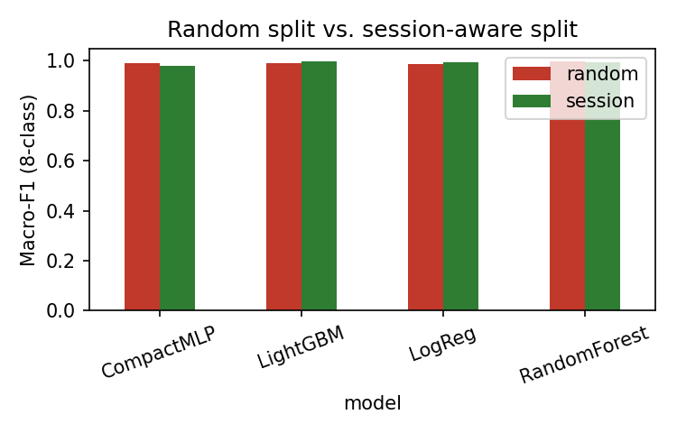
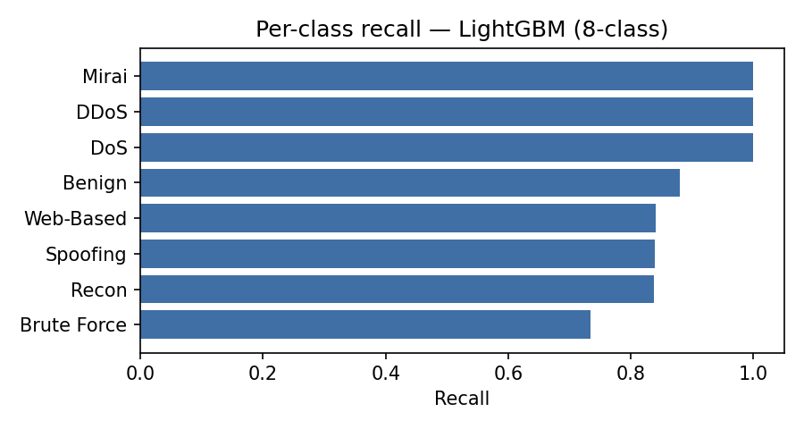
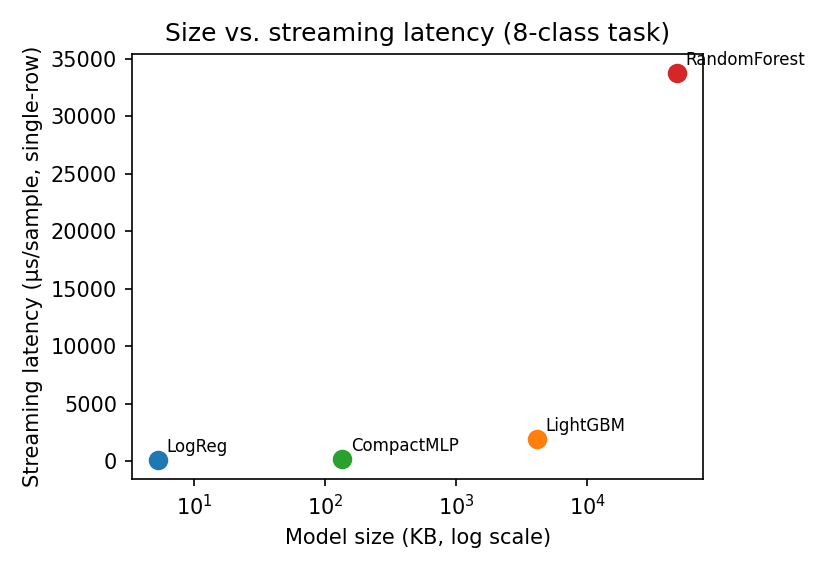

# Fog-IDS Pipeline — Results Report

Data source: **REAL CICIoT2023 data** (uploaded redistribution, `train.csv`/`test.csv`, per-class capped at 6000 for this sandbox's RAM/CPU -- large classes like DDoS/DoS are subsampled, every minority class below the cap is kept in full). The dataset provider's own train/test split was used for the main benchmark (Section 2). The RQ2 leakage experiment (Section 1) is run on the synthetic generator instead, because this real redistribution is already row-shuffled and its original capture-session boundaries cannot be recovered -- see `src/loader.py::load_real_presplit` docstring for the measurement that established this.

**All fog-node results in Section 5 are a software simulation** — the dataset is partitioned across N logical nodes inside this one process. No physical fog hardware is used anywhere in this project.

- Rows in sample: 277,369  |  Sessions: 277,369  |  Models benchmarked: CompactMLP, LightGBM, LogReg, RandomForest

## 0. True population class shares vs. this sample (per-class cap = 6000)

Exact counts from a first full-file pass over the real `train.csv`, **before** any capping -- this is the real, heavily-imbalanced CICIoT2023 distribution, shown so the capped sample above is never mistaken for it. Deployment-time accuracy should be weighted by these true shares, not by the capped sample's shares.

| category    |   true_share_% |   true_count_train |   sampled_share_% |
|:------------|---------------:|-------------------:|------------------:|
| DDoS        |         72.806 |            3998500 |             45.75 |
| DoS         |         17.31  |             950656 |             15.7  |
| Mirai       |          5.64  |             309768 |             12.93 |
| Benign      |          2.359 |             129538 |              4.27 |
| Spoofing    |          1.048 |              57530 |              8.13 |
| Recon       |          0.758 |              41617 |             11.32 |
| Web-Based   |          0.051 |               2821 |              1.24 |
| Brute Force |          0.028 |               1541 |              0.67 |

## 1. Leakage effect (RQ2): random split vs. session-aware split (synthetic data — see note above)

| model        |   ('accuracy', 'random') |   ('accuracy', 'session') |   ('macro_f1', 'random') |   ('macro_f1', 'session') |
|:-------------|-------------------------:|--------------------------:|-------------------------:|--------------------------:|
| CompactMLP   |                   0.999  |                    0.9993 |                   0.9889 |                    0.9788 |
| LightGBM     |                   0.9996 |                    0.9999 |                   0.9913 |                    0.998  |
| LogReg       |                   0.9992 |                    0.9997 |                   0.9853 |                    0.994  |
| RandomForest |                   0.9998 |                    0.9998 |                   0.9985 |                    0.996  |

## 2. Main benchmark (dataset provider's official train/test split)

### binary

| model        |   accuracy |   macro_f1 |   weighted_f1 |   n_train |   n_test |
|:-------------|-----------:|-----------:|--------------:|----------:|---------:|
| LogReg       |     0.9611 |     0.6889 |        0.9521 |    152525 |   124844 |
| LightGBM     |     0.9803 |     0.906  |        0.9816 |    152525 |   124844 |
| CompactMLP   |     0.9674 |     0.7615 |        0.9619 |    152525 |   124844 |
| RandomForest |     0.9786 |     0.8972 |        0.9799 |    152525 |   124844 |

### 8class

| model        |   accuracy |   macro_f1 |   weighted_f1 |   n_train |   n_test |
|:-------------|-----------:|-----------:|--------------:|----------:|---------:|
| LogReg       |     0.7699 |     0.548  |        0.7391 |    152525 |   124844 |
| LightGBM     |     0.9674 |     0.8099 |        0.9707 |    152525 |   124844 |
| CompactMLP   |     0.8338 |     0.6432 |        0.8245 |    152525 |   124844 |
| RandomForest |     0.9524 |     0.766  |        0.9589 |    152525 |   124844 |

### 34class

| model        |   accuracy |   macro_f1 |   weighted_f1 |   n_train |   n_test |
|:-------------|-----------:|-----------:|--------------:|----------:|---------:|
| LogReg       |     0.7357 |     0.5314 |        0.7225 |    152525 |   124844 |
| LightGBM     |     0.9579 |     0.8064 |        0.9598 |    152525 |   124844 |
| CompactMLP   |     0.8104 |     0.6357 |        0.8112 |    152525 |   124844 |
| RandomForest |     0.9151 |     0.7385 |        0.9268 |    152525 |   124844 |

## 3. Per-class recall — best model on 8-class task (LightGBM)

| class       |   precision |   recall |    f1 |   support |
|:------------|------------:|---------:|------:|----------:|
| DDoS        |       1     |    1     | 1     |     60923 |
| DoS         |       1     |    0.999 | 0.999 |     19722 |
| Mirai       |       1     |    1     | 1     |     17956 |
| Spoofing    |       0.942 |    0.84  | 0.888 |     10527 |
| Recon       |       0.928 |    0.838 | 0.881 |      8812 |
| Benign      |       0.84  |    0.879 | 0.859 |      5959 |
| Web-Based   |       0.269 |    0.84  | 0.407 |       626 |
| Brute Force |       0.32  |    0.734 | 0.445 |       319 |

## 4. Deployability profile

Two latency columns, because they answer different questions. `batch_us_per_sample` times ONE `predict()` call over the whole test set and divides by row count -- a throughput number, which understates real cost because vectorised batch prediction amortises Python/array overhead across thousands of rows. `streaming_us_per_sample` times `predict()` called ONCE PER ROW (300 single-row calls, averaged) -- what a fog node actually experiences as packet-windows arrive one at a time. The Pi4 estimate is scaled from the streaming number, since that is the deployment-relevant one. The gap between the two is large and model-dependent: roughly 260x for LogReg, ~1,000x+ for RandomForest (many trees, each a Python-level traversal with fixed per-call cost), ~15-20x for LightGBM, ~40-280x for CompactMLP. RandomForest's streaming cost (5.6-5.8 ms/sample here, an estimated 28-38 ms on Pi4-class hardware) makes it impractical for real-time per-packet classification despite its strong accuracy and deceptively low batch number -- this would have been missed entirely under batch-only timing.

| model        | task    | split   |   size_kb |   batch_us_per_sample |   streaming_us_per_sample |   pi4_est_us_per_sample_low |   pi4_est_us_per_sample_high |   n_test |
|:-------------|:--------|:--------|----------:|----------------------:|--------------------------:|----------------------------:|-----------------------------:|---------:|
| LogReg       | binary  | session |       2.6 |                 0.24  |                     94.46 |                       472.3 |                        614   |   124844 |
| LogReg       | 8class  | session |       5.3 |                 0.339 |                     78.6  |                       393   |                        510.9 |   124844 |
| LogReg       | 34class | session |      15.6 |                 0.904 |                     81.57 |                       407.8 |                        530.2 |   124844 |
| LightGBM     | binary  | session |     517.8 |                 1.489 |                   1214.82 |                      6074.1 |                       7896.3 |   124844 |
| LightGBM     | 8class  | session |    4133.8 |                18.691 |                   1876.01 |                      9380.1 |                      12194.1 |   124844 |
| LightGBM     | 34class | session |   15563.9 |               188.535 |                   3480.03 |                     17400.2 |                      22620.2 |   124844 |
| CompactMLP   | binary  | session |     129.4 |                 1.048 |                    121.85 |                       609.3 |                        792   |   124844 |
| CompactMLP   | 8class  | session |     135.4 |                 1.215 |                    132.11 |                       660.6 |                        858.7 |   124844 |
| CompactMLP   | 34class | session |     156.6 |                 1.704 |                    123.63 |                       618.2 |                        803.6 |   124844 |
| RandomForest | binary  | session |   10956.3 |                 2.32  |                  33825.7  |                    169128   |                     219867   |   124844 |
| RandomForest | 8class  | session |   48522   |                 5.051 |                  33755.7  |                    168778   |                     219412   |   124844 |
| RandomForest | 34class | session |  103906   |                13.671 |                  33562.8  |                    167814   |                     218158   |   124844 |

## 5. SIMULATED fog-node emulation (4 software partitions of the dataset)

| strategy      |   accuracy |   macro_f1 | mean_classes_seen_per_node   | total_classes   | rounds   | local_epochs   |
|:--------------|-----------:|-----------:|:-----------------------------|:----------------|:---------|:---------------|
| centralized   |     0.9532 |     0.7678 | —                            | —               | —        | —              |
| per_node      |     0.955  |     0.779  | 8.0                          | 8.0             | —        | —              |
| federated_avg |     0.7584 |     0.5201 | —                            | —               | 15.0     | 5.0            |